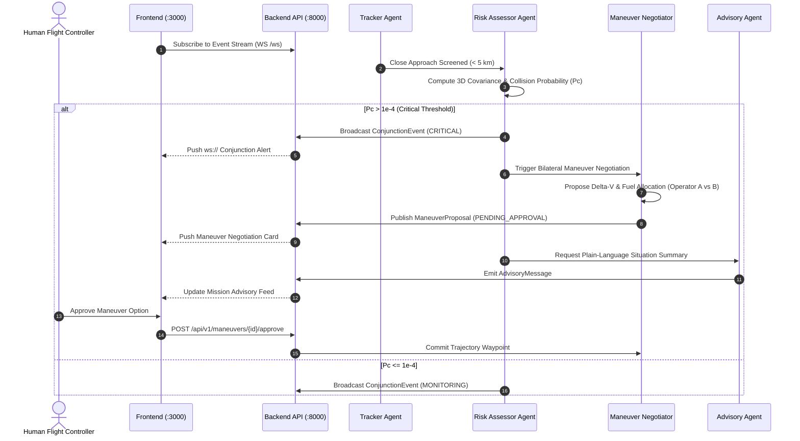
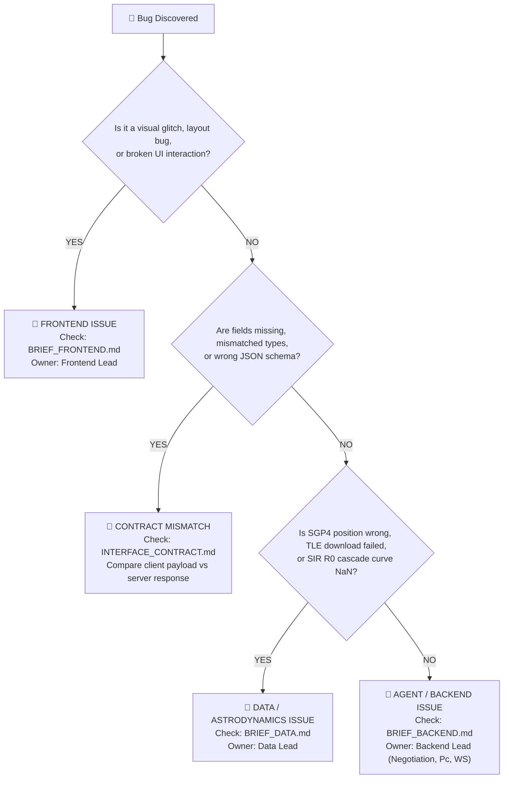

# Auralis 🛰️

> **Autonomous Orbital Debris Tracking & Collision Risk Management System**  
> Built for hackathon mission-critical deployment by a 3-person engineering crew.

---

## 1. What This Is

**Auralis** is an autonomous mission-control web platform designed to monitor Low Earth Orbit (LEO) congestion, predict satellite collisions, and negotiate collision-avoidance maneuvers. It ingests live TLE orbital data from CelesTrak, propagates orbits using SGP4 physics models, computes rigorous 3D collision probabilities ($P_c$), simulates long-term debris cascade propagation using an epidemiological SIR model, and coordinates multi-agent autonomous negotiation between simulated satellite operators.

For full product vision, design philosophies, operational user personas, and hackathon scope, see [PRD.md](file:///d:/coding_files/gdg/PRD.md).

---

## 2. System Architecture & Design

### 2.1 High-Level Architecture

```mermaid
graph TD
    subgraph External Data
        CT["CelesTrak API<br/>(Active Satellites & Debris TLEs)"]
    end

    subgraph Data Layer ["Data & Physics Layer (BRIEF_DATA.md)"]
        Ingest["TLE Ingestion Engine"]
        SGP4["SGP4 Orbit Propagator"]
        SIR["SIR Epidemiological<br/>Debris Cascade Model"]
        Shells["Shell Binning Engine<br/>(LEO-1 to GEO)"]
        
        Ingest --> SGP4
        SGP4 --> Shells
        Shells --> SIR
    end

    subgraph Backend Layer ["Agent & API Layer (BRIEF_BACKEND.md)"]
        API["FastAPI / Express Server<br/>(:8000)"]
        WS["WebSocket Hub<br/>(/ws)"]
        
        subgraph Multi-Agent Mesh
            TrackerAgent["Tracker Agent<br/>(State & Screening)"]
            RiskAgent["Risk Assessor Agent<br/>(3D Covariance & Pc)"]
            ForecasterAgent["Epidemic Forecaster<br/>(R0 & Cascade Spread)"]
            NegotiatorAgent["Maneuver Negotiation<br/>(Operator Bilateral Trade)"]
            AnomalyAgent["Anomaly Agent<br/>(Telemetry & Sensor Jitter)"]
            AdvisoryAgent["Advisory Agent<br/>(Natural Language Briefs)"]
        end

        API --- WS
        WS <--> Multi-Agent Mesh
    end

    subgraph Frontend Layer ["Mission Control UI (BRIEF_FRONTEND.md)"]
        Next["Next.js 16 Dashboard<br/>(:3000)"]
        Globe["3D WebGL / Globe.gl<br/>(Orbit & Conjunction View)"]
        MockLive["API Client / Switcher<br/>(Mock ⇄ Live REST/WS)"]
        
        Next --> Globe
        Next --> MockLive
    end

    CT --> Ingest
    DataLayer --> BackendLayer
    BackendLayer <== "REST /api/v1 & WebSockets" ==> FrontendLayer
```

---

### 2.2 Autonomous Multi-Agent Pipeline



---

### 2.3 Shell Discretization & Cascade Model (SIR)

Orbital space is partitioned into altitude bands to model debris epidemics analogous to pathogen transmission:

| Shell ID | Altitude Range | Typical Population | Inherent Risk Profile |
| :--- | :--- | :--- | :--- |
| `LEO-1` | 200 – 500 km | VLEO, ISS, Starlink ingress | Atmospheric self-cleansing (high drag) |
| `LEO-2` | 500 – 800 km | Mega-constellations (Starlink, OneWeb) | **Critical density**: Peak collision cascade risk |
| `LEO-3` | 800 – 1200 km | Sun-synchronous, Earth observation | High debris residue, low atmospheric drag |
| `MEO` | 1200 – 35,786 km | Navigation constellations (GPS, Galileo) | Sparse density, long orbital lifetimes |
| `GEO` | ~35,786 km | Geostationary telecommunications | High value, orbital slot congestion |

---

## 3. Getting Started

### 3.1 Prerequisites
- **Node.js**: `v18.x` or `v20.x` LTS
- **Python**: `3.10+` (if running Python-based Data/Backend services)
- **Package Manager**: `npm` or `pnpm`

---

### 3.2 Environment Setup

Create `.env.local` in the project root:

```env
# ==============================================================================
# FRONTEND CONFIGURATION
# ==============================================================================
# Toggle between 'mock' (internal mock data generator) and 'live' (backend server)
NEXT_PUBLIC_API_MODE=mock

# Base URL for Backend REST API
NEXT_PUBLIC_API_BASE_URL=http://localhost:8000/api/v1

# Base URL for Backend Realtime WebSocket
NEXT_PUBLIC_WS_URL=ws://localhost:8000/ws

# ==============================================================================
# DATA LAYER CONFIGURATION
# ==============================================================================
# Public CelesTrak Active Satellites GP Endpoint (No auth token required)
CELESTRAK_BASE_URL=https://celestrak.org/NORAD/elements/gp.php
CELESTRAK_GROUP=active
CELESTRAK_FORMAT=json

# Update interval in seconds (default: 300s = 5 minutes)
INGESTION_INTERVAL_SECONDS=300

# ==============================================================================
# BACKEND & AGENT CONFIGURATION (Optional / LLM fallback)
# ==============================================================================
PORT=8000
HOST=0.0.0.0
CORS_ORIGINS=http://localhost:3000
# Optional Gemini API key if enabling real LLM advisory synthesis
GEMINI_API_KEY=
```

---

### 3.3 Installation & Running

#### 1. Frontend Web App (Port 3000)
```bash
# Install dependencies
npm install

# Start Next.js development server
npm run dev

# Open http://localhost:3000 in your browser
```

#### 2. Backend Agent Service (Port 8000)
*(Refer to [BRIEF_BACKEND.md](file:///d:/coding_files/gdg/BRIEF_BACKEND.md) for detailed runtime setup)*
```bash
# Example if using Python FastAPI in backend/
cd backend
python -m venv venv
source venv/bin/activate  # Or `venv\Scripts\activate` on Windows
pip install -r requirements.txt
uvicorn main:app --reload --port 8000
```

#### 3. Data & Propagation Service
*(Refer to [BRIEF_DATA.md](file:///d:/coding_files/gdg/BRIEF_DATA.md) for ingestion & SGP4 harness)*
```bash
# Example test run for TLE ingestion & SGP4 verification
cd data
python ingest.py --group active --limit 500
```

---

## 4. Folder-to-Owner Map

Each section of the repository has a single point of contact responsible for reviews and implementation.

| Directory / File Path | Description | Owner | Brief Reference |
| :--- | :--- | :--- | :--- |
| `app/` | Next.js App Router pages (Dashboard, Conjunctions, Orbit 3D, Analytics, Advisory, Settings) | **Frontend Lead** | [BRIEF_FRONTEND.md](file:///d:/coding_files/gdg/BRIEF_FRONTEND.md) |
| `components/` | Reusable UI components (Globe, Charts, Tables, Alerts, Agent chat drawers) | **Frontend Lead** | [BRIEF_FRONTEND.md](file:///d:/coding_files/gdg/BRIEF_FRONTEND.md) |
| `lib/` | Theme, Auth, Translations, Mock Data Generator, and API client | **Frontend Lead** | [BRIEF_FRONTEND.md](file:///d:/coding_files/gdg/BRIEF_FRONTEND.md) |
| `types/` | Frontend-specific UI and viewmodel typings | **Frontend Lead** | [BRIEF_FRONTEND.md](file:///d:/coding_files/gdg/BRIEF_FRONTEND.md) |
| `public/` | Static media, icons, and textures | **Frontend Lead** | [BRIEF_FRONTEND.md](file:///d:/coding_files/gdg/BRIEF_FRONTEND.md) |
| `backend/` | 6 Autonomous Agents, FastAPI/Express app, WebSocket server, maneuver logic | **Backend Lead** | [BRIEF_BACKEND.md](file:///d:/coding_files/gdg/BRIEF_BACKEND.md) |
| `data/` | CelesTrak scraper, SGP4 propagator, SIR epidemiological cascade simulator | **Data Lead** | [BRIEF_DATA.md](file:///d:/coding_files/gdg/BRIEF_DATA.md) |
| `INTERFACE_CONTRACT.md` | Canonical TypeScript data shapes, REST paths, and WebSocket schemas | **Shared (All 3)** | [INTERFACE_CONTRACT.md](file:///d:/coding_files/gdg/INTERFACE_CONTRACT.md) |
| `PRD.md` | Product Requirements & Hackathon Scope | **Shared (All 3)** | [PRD.md](file:///d:/coding_files/gdg/PRD.md) |

---

## 5. Branch & PR Workflow

Follow these rules strictly during the hackathon to avoid merge conflicts and broken demo builds:

- 🛡️ **`main` is SACRED**: `main` must remain **demo-ready at all times**. No one commits directly to `main`.
- 🔀 **`dev` is the INTEGRATION branch**: All tested feature branches merge into `dev`. Never commit directly to `dev`.
- 🌿 **Short-lived feature branches**:
  - Branch off `dev` per task (e.g., `feat/frontend-globe`, `feat/backend-risk-agent`, `fix/sgp4-epoch`).
  - Keep branches alive for a **maximum of 1 day**.
- 🔄 **Rebase before starting**:
  - Always `git pull origin dev --rebase` before writing new code.
- ⚠️ **Shared Files Policy**:
  - `package.json`, `INTERFACE_CONTRACT.md`, root configs, and shared types require an **explicit heads-up** in Discord/chat before modification.
  - Merged immediately in an isolated, minimal PR to prevent blocking teammates.
- ✅ **Review & Merge Protocol**:
  - **One peer review** required to merge into `dev`.
  - Merge `dev` into `main` **only at scheduled demo milestones** after verification.

---

## 6. Where to Look When Something Breaks

When a bug surfaces during testing or the live demo, use this decision matrix to identify who owns the problem:



### Quick Diagnostic Cheat Sheet

| Symptom | Source of Truth Document | Who to Ping | Immediate Triage Action |
| :--- | :--- | :--- | :--- |
| **Data shape mismatch / 422 Unprocessable Entity** | [INTERFACE_CONTRACT.md](file:///d:/coding_files/gdg/INTERFACE_CONTRACT.md) | Both FE & BE Leads | Check field naming (e.g. `primary_object_id` vs `primaryObjectId`, ISO timestamp strings). |
| **Globe points missing or rendering at Earth center** | [BRIEF_FRONTEND.md](file:///d:/coding_files/gdg/BRIEF_FRONTEND.md) & [INTERFACE_CONTRACT.md](file:///d:/coding_files/gdg/INTERFACE_CONTRACT.md) | Frontend Lead | Verify `latitude`, `longitude`, and `altitude_km` are parsed as floats, not strings. |
| **Orbit positions not moving or static** | [BRIEF_DATA.md](file:///d:/coding_files/gdg/BRIEF_DATA.md) | Data Lead | Check SGP4 epoch propagation step and system clock synchronizer. |
| **Maneuver bilateral status stuck in `PROPOSED`** | [BRIEF_BACKEND.md](file:///d:/coding_files/gdg/BRIEF_BACKEND.md) | Backend Lead | Check negotiation agent state machine transitions and approval endpoint. |
| **WebSocket disconnects or fails to connect** | [INTERFACE_CONTRACT.md](file:///d:/coding_files/gdg/INTERFACE_CONTRACT.md) | Backend Lead | Check port 8000 accessibility, CORS headers, and heartbeat ping/pong format. |
| **Next.js UI crash / React hydration error** | [BRIEF_FRONTEND.md](file:///d:/coding_files/gdg/BRIEF_FRONTEND.md) | Frontend Lead | Switch `NEXT_PUBLIC_API_MODE=mock` to isolate UI state from backend stream. |

---

*Mission Control Status: **Nominal** • Keep branches green and orbits safe.* 🚀