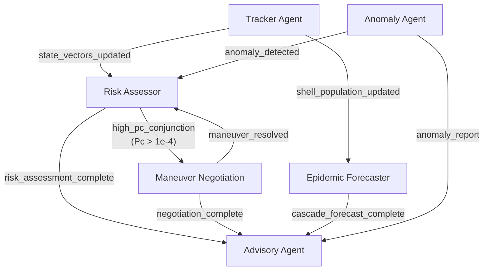

# System Architecture — Auralis

> Describes the actual state of this codebase as inspected on disk, the target
> architecture defined by the team's design docs, and where new code should go.
>
> **Last inspected:** 2026-09-12
> **Reference docs:** [PRD.md](./PRD.md) · [INTERFACE_CONTRACT.md](./INTERFACE_CONTRACT.md) · [BRIEF_BACKEND.md](./BRIEF_BACKEND.md) · [BRIEF_FRONTEND.md](./BRIEF_FRONTEND.md) · [BRIEF_DATA.md](./BRIEF_DATA.md)

---

## 1. Current State (As-Inspected)

This is exactly what exists on disk right now. Items marked ⚠️ are mismatches
against what INTERFACE_CONTRACT.md or the briefs expect.

```
gdg/                                    ← repo root (Next.js 16 project)
│
├── app/                                ← Next.js App Router
│   ├── layout.tsx                      ← Root layout (ThemeProvider, AuthProvider, fonts)
│   ├── page.tsx                        ← Landing page (95 KB — fully built)
│   ├── globals.css                     ← Global stylesheet (Tailwind v4 + design tokens)
│   ├── favicon.ico
│   └── (auth)/                         ← Authenticated route group
│       ├── layout.tsx                  ← Auth layout (sidebar + header shell)
│       ├── dashboard/page.tsx          ← Command Center / overview
│       ├── data-ingestion/page.tsx     ← TLE ingestion status view
│       ├── chat/page.tsx               ← Advisory agent chat placeholder
│       ├── network/page.tsx            ← Object graph / relationship view
│       ├── analytics/page.tsx          ← Analytics & trends
│       ├── cases/page.tsx              ← Conjunction events list
│       ├── cases/[id]/page.tsx         ← Conjunction event detail
│       ├── profiles/page.tsx           ← Tracked objects list
│       ├── profiles/[id]/page.tsx      ← Tracked object detail
│       ├── alerts/page.tsx             ← Risk alerts
│       ├── financial/page.tsx          ← Fuel ledger (optional scope)
│       ├── audit/page.tsx              ← Audit & governance log
│       ├── settings/page.tsx           ← Application settings
│       └── settings/permissions/page.tsx ← RBAC / permissions
│
├── components/
│   ├── layout/                         ← App chrome
│   │   ├── AppSidebar.tsx              ← Main navigation sidebar
│   │   ├── TopHeader.tsx               ← Top bar (search, theme toggle, user)
│   │   └── NotificationCenter.tsx      ← Notification dropdown
│   ├── dashboard/                      ← Command Center widgets
│   │   ├── LiveMap.tsx                 ← Map placeholder (not yet globe.gl)
│   │   ├── LiveEventFeed.tsx           ← Real-time event ticker
│   │   ├── EarlyWarningSection.tsx     ← Risk alert summary cards
│   │   └── QuickMLBar.tsx              ← Stat bar
│   ├── charts/
│   │   └── CrimeTrendChart.tsx         ← ⚠️ Named from old project; recharts line chart
│   ├── shared/                         ← Cross-cutting utility components
│   │   ├── EmptyState.tsx
│   │   ├── ErrorBoundary.tsx
│   │   ├── SkeletonLoader.tsx
│   │   └── ClientMaskedName.tsx
│   ├── reports/                        ← Print/export helpers
│   │   ├── PrintButton.tsx
│   │   ├── PrintHeader.tsx
│   │   └── PrintFooter.tsx
│   └── ui/                             ← Primitive UI kit (21 components)
│       ├── alert.tsx, avatar.tsx, badge.tsx, breadcrumb.tsx, button.tsx
│       ├── card.tsx, dropdown-menu.tsx, explainability-badge.tsx
│       ├── infinite-marquee.tsx, input.tsx, label.tsx, progress.tsx
│       ├── scroll-animation.tsx, select.tsx, separator.tsx, sheet.tsx
│       ├── skeleton.tsx, slideshow.tsx, table.tsx, tabs.tsx, textarea.tsx
│
├── lib/
│   ├── AuthContext.tsx                 ← Auth state (mock login, role-based)
│   ├── ThemeContext.tsx                ← Dark/light theme toggle
│   ├── LanguageContext.tsx             ← i18n context
│   ├── mockData.ts                     ← ⚠️ 21 KB of mock data — uses OLD field shapes,
│   │                                     NOT the INTERFACE_CONTRACT.md shapes yet
│   ├── translations.ts                ← Full i18n string table (82 KB)
│   ├── utils.ts                       ← General utilities (cn, formatDate, etc.)
│   ├── api/
│   │   └── auditLogger.ts             ← Client-side audit event helper
│   └── utils/
│       └── dataMasking.ts             ← PII/data masking utility
│
├── types/
│   └── index.ts                        ← ⚠️ 146 lines of domain types — uses Auralis-named
│                                         types but field names/shapes diverge from
│                                         INTERFACE_CONTRACT.md (see §Mismatches below)
│
├── public/                             ← Static assets (SVG icons only — no globe textures yet)
│   ├── file.svg, globe.svg, next.svg, vercel.svg, window.svg
│
├── package.json                        ← name: "space-orbital-intel", Next.js 16, React 19
├── next.config.ts                      ← Minimal Next.js config
├── tsconfig.json                       ← Standard TS config
├── postcss.config.mjs                  ← PostCSS → Tailwind v4
├── eslint.config.mjs                   ← ESLint flat config
│
├── PRD.md                              ← Product requirements (16 KB)
├── INTERFACE_CONTRACT.md               ← Canonical data shapes & API spec (31 KB)
├── BRIEF_BACKEND.md                    ← Backend person's task list (12 KB)
├── BRIEF_FRONTEND.md                   ← Frontend person's task list (14 KB)
├── BRIEF_DATA.md                       ← Data person's task list (15 KB)
├── CONTRIBUTING.md                     ← Team process rules (5 KB)
├── README.md                           ← Project overview & getting started (13 KB)
└── Problem Statement.docx              ← Original problem statement
```

### Directories that do NOT exist yet

| Expected directory | Defined in | Status |
|---|---|---|
| `backend/` | BRIEF_BACKEND.md | **Does not exist.** Backend person has not started. |
| `data/` | BRIEF_DATA.md | **Does not exist.** Data person has not started. |
| `types/contract.ts` | BRIEF_FRONTEND.md task A1 | **Does not exist.** The contract-aligned types file has not been created. |
| `lib/mockApi.ts` | BRIEF_FRONTEND.md task A2 / INTERFACE_CONTRACT.md §5 | **Does not exist.** Mock API stub not yet built. |

### Known Mismatches: `types/index.ts` vs INTERFACE_CONTRACT.md

The existing `types/index.ts` was written before the interface contract was finalized.
These are the field and naming divergences — they need to be resolved by the
Frontend person when building `types/contract.ts` (task A1).

| Shape | `types/index.ts` (current) | `INTERFACE_CONTRACT.md` (canonical) | Difference |
|---|---|---|---|
| **TrackedObject.type** | `ObjectType` = `'Active Satellite' \| 'Rocket Body' \| ...` | `ObjectType` = `"satellite" \| "debris" \| "rocket_body" \| "unknown"` | Different string values |
| **TrackedObject** | Flat fields: `apogee`, `perigee`, `inclination`, `rcs` | Nested `position`, `velocity`, `orbitalElements`, `covarianceUpperTriangle` | Completely different structure |
| **TrackedObject.status** | `'Operational' \| 'Decaying' \| 'Tumbling' \| 'Decommissioned'` | `"active" \| "decayed" \| "maneuvering" \| "unknown"` | Different values |
| **ConjunctionEvent** | Has `primaryObjectName`, `primaryOperator`, `summary` | Does not have those — uses IDs only, status is enum | Extra/missing fields |
| **ShellRiskSnapshot** | Does not exist (closest: `OrbitalShellStat`) | Full SIR model with `susceptibleCount`, `infectedCount`, `removedCount`, `r0`, projections | Missing entirely |
| **ManeuverProposal** | Does not exist (closest: `AgentNegotiationLog`) | Full proposal with `deltaV`, `burnTime`, `fuelCost`, `negotiationLog[]` | Missing entirely |

> **Resolution:** Do NOT modify `types/index.ts` — the existing pages depend on
> it. Create a new `types/contract.ts` with the canonical shapes. Migrate pages
> to the new types one at a time as they get wired up.

### Known Naming Artifact

`components/charts/CrimeTrendChart.tsx` still has its name from the predecessor
project (CrimeIntel). The chart itself is a generic Recharts line chart and will
work for Auralis analytics — only the filename/component name is stale.

---

## 2. Target Architecture

```mermaid
graph LR
    subgraph External
        CT["CelesTrak API<br/>(GP elements, JSON)"]
    end

    subgraph DataLayer ["data/ — Data & Propagation Layer"]
        Fetch["celestrak.ts<br/>TLE fetcher"]
        Parse["parser.ts<br/>TLE → TrackedObject"]
        SGP4["propagator.ts<br/>SGP4 orbit propagation"]
        SIR["cascade.ts<br/>SIR epidemic model"]
        EpiFore["Epidemic Forecaster<br/>Agent"]
    end

    subgraph BackendLayer ["backend/ — Agent & API Layer"]
        Bus["Message Bus<br/>(AgentMessage envelope)"]
        Tracker["Tracker Agent"]
        Risk["Risk Assessor Agent"]
        Negotiate["Maneuver Negotiation<br/>Agent"]
        Anomaly["Anomaly Agent"]
        Advisory["Advisory Agent"]
        Store["In-Memory Store"]
        API["REST API<br/>(:8000/api/v1/*)"]
        WS["WebSocket Server<br/>(:8000/ws)"]
    end

    subgraph FrontendLayer ["app/ + components/ — Frontend"]
        MockAPI["lib/mockApi.ts<br/>(dev fallback)"]
        Client["lib/api.ts<br/>(live client)"]
        Pages["11 route pages"]
        Globe["Globe.gl 3D view"]
    end

    CT -- "GET gp.php?GROUP=active" --> Fetch
    Fetch --> Parse
    Parse --> SGP4
    SGP4 --> SIR

    SGP4 -- "state_vectors_updated" --> Tracker
    Tracker -- "state_vectors_updated" --> Risk
    Tracker -- "shell_population_updated" --> EpiFore
    EpiFore -- "cascade_forecast_complete" --> Advisory

    Risk -- "high_pc_conjunction" --> Negotiate
    Risk -- "risk_assessment_complete" --> Advisory
    Negotiate -- "maneuver_resolved" --> Risk
    Negotiate -- "negotiation_complete" --> Advisory
    Anomaly -- "anomaly_detected" --> Risk
    Anomaly -- "anomaly_report" --> Advisory

    Tracker & Risk & Negotiate & Anomaly & Advisory <--> Bus
    Bus --> Store
    Store --> API
    Store --> WS

    API -- "GET /objects, /conjunctions,<br/>/shells, /maneuvers,<br/>/advisories, /audit,<br/>/agents/status,<br/>/dashboard/summary" --> Client
    API -- "POST /crisis/inject,<br/>POST /maneuvers/:id/approve" --> Client
    WS -- "objects:updated,<br/>conjunction:created/updated/mitigated,<br/>shell:updated,<br/>maneuver:proposed/resolved,<br/>advisory:new,<br/>anomaly:detected,<br/>agent:status,<br/>crisis:injected" --> Client

    MockAPI -.-> Pages
    Client --> Pages
    Pages --> Globe
```



### Agent Message Flow (Detail)



---

## 3. Where New Code Goes

Proposed folder paths for the two modules that don't exist yet. These follow the
existing project's conventions: lowercase kebab-case folders, `.ts` extensions
for logic, single-responsibility files.

### 3.1 `data/` — Data & Propagation Layer

```
data/
├── celestrak.ts           ← CelesTrak fetcher (HTTP GET, JSON parse)
├── parser.ts              ← GP element → TrackedObject mapper
├── propagator.ts          ← SGP4 propagation (satellite.js or sgp4 package)
├── collision.ts           ← Conjunction screening & Pc computation
├── cascade.ts             ← SIR epidemiological model over orbital shells
├── shells.ts              ← Shell binning logic (50 km bands, shell ID convention)
├── epidemic-forecaster.ts ← Epidemic Forecaster agent wrapper
├── types.ts               ← Internal types (if needed beyond contract shapes)
├── index.ts               ← Public exports
├── package.json           ← If Python: requirements.txt instead
└── __tests__/             ← Unit tests for propagation & SIR math
    ├── propagator.test.ts
    ├── collision.test.ts
    └── cascade.test.ts
```

### 3.2 `backend/` — Agent & API Layer

```
backend/
├── server.ts              ← Express or FastAPI entry point (:8000)
├── message-bus.ts         ← In-memory pub-sub (AgentMessage<T> envelope)
├── store.ts               ← In-memory typed collections (Map<string, T>)
├── agents/
│   ├── base-agent.ts      ← Abstract agent class (subscribe, publish, heartbeat)
│   ├── tracker.ts         ← Tracker Agent — receives propagated state, screens
│   ├── risk-assessor.ts   ← Risk Assessor — Pc computation, threshold checks
│   ├── maneuver-negotiation.ts ← Bilateral Δv negotiation between operators
│   ├── anomaly.ts         ← Detects orbit changes between TLE epochs
│   └── advisory.ts        ← Synthesizes plain-language situation briefs
├── routes/
│   ├── objects.ts         ← GET /api/v1/objects, GET /api/v1/objects/:id
│   ├── conjunctions.ts    ← GET /api/v1/conjunctions, GET /api/v1/conjunctions/:id
│   ├── shells.ts          ← GET /api/v1/shells
│   ├── maneuvers.ts       ← GET /api/v1/maneuvers, POST /api/v1/maneuvers/:id/approve
│   ├── advisories.ts      ← GET /api/v1/advisories
│   ├── audit.ts           ← GET /api/v1/audit
│   ├── agents.ts          ← GET /api/v1/agents/status
│   ├── dashboard.ts       ← GET /api/v1/dashboard/summary
│   └── crisis.ts          ← POST /api/v1/crisis/inject
├── ws/
│   └── handler.ts         ← WebSocket upgrade + event broadcast
├── types/                 ← Pydantic models or TS types copied from contract
│   └── contract.ts
├── package.json           ← If Python: requirements.txt instead
└── __tests__/
    ├── risk-assessor.test.ts
    └── maneuver-negotiation.test.ts
```

### 3.3 Frontend Files Still Needed (within existing folders)

These don't require new top-level folders — they slot into the existing `lib/`
and `types/` directories.

| File | Purpose | Brief task ref |
|---|---|---|
| `types/contract.ts` | Canonical TypeScript shapes from INTERFACE_CONTRACT.md §1–4 | BRIEF_FRONTEND A1 |
| `lib/mockApi.ts` | Mock API with same function signatures as real API | BRIEF_FRONTEND A2 |
| `lib/api.ts` | Live REST + WebSocket client | BRIEF_FRONTEND A3 |

---

## 4. Ownership Map

Cross-referenced against [CONTRIBUTING.md](./CONTRIBUTING.md)'s ownership table.
Matches are confirmed ✅; new rows for proposed paths marked 🆕.

| Path | Owner | Brief | CONTRIBUTING.md alignment |
|---|---|---|---|
| `app/` | Frontend person | [BRIEF_FRONTEND.md](./BRIEF_FRONTEND.md) | ✅ Matches |
| `components/` | Frontend person | [BRIEF_FRONTEND.md](./BRIEF_FRONTEND.md) | ✅ Matches |
| `lib/` | Frontend person | [BRIEF_FRONTEND.md](./BRIEF_FRONTEND.md) | ✅ Matches |
| `types/` | Frontend person | [BRIEF_FRONTEND.md](./BRIEF_FRONTEND.md) | ✅ Matches |
| `public/` | Frontend person | [BRIEF_FRONTEND.md](./BRIEF_FRONTEND.md) | ✅ Matches |
| `backend/` 🆕 | Backend person | [BRIEF_BACKEND.md](./BRIEF_BACKEND.md) | ✅ Matches |
| `backend/agents/` 🆕 | Backend person | [BRIEF_BACKEND.md](./BRIEF_BACKEND.md) | ✅ Matches |
| `backend/routes/` 🆕 | Backend person | [BRIEF_BACKEND.md](./BRIEF_BACKEND.md) | ✅ Matches |
| `backend/ws/` 🆕 | Backend person | [BRIEF_BACKEND.md](./BRIEF_BACKEND.md) | ✅ Matches |
| `data/` 🆕 | Data person | [BRIEF_DATA.md](./BRIEF_DATA.md) | ✅ Matches |
| `INTERFACE_CONTRACT.md` | All three | Shared | ✅ Matches |
| `package.json` | All three | Shared | ✅ Matches |
| Root configs | Frontend person (primary) | — | ✅ Matches |

No mismatches found between this document and CONTRIBUTING.md.

---

## 5. Structural Changes Disclaimer

> **This document describes structure only.** It does not grant permission to
> move, rename, or restructure any existing file.
>
> If the target architecture implies a change to something that already exists,
> it is described here as a **recommendation** — a human decides whether and when
> to act on it.

### Recommendations (not directives)

| Existing item | Recommended change | Reason | Risk |
|---|---|---|---|
| `types/index.ts` | Keep as-is; create `types/contract.ts` alongside it | Current pages depend on the old shapes. Migrating them is a separate task per page. | None if both files coexist. |
| `lib/mockData.ts` | Replace with `lib/mockApi.ts` that returns contract-shaped data | INTERFACE_CONTRACT.md §5 requires mock data to match canonical shapes exactly. | Pages will break until they switch to the new import — do this per-page, not all at once. |
| `components/charts/CrimeTrendChart.tsx` | Rename to `DebrisTrendChart.tsx` or `CascadeTrendChart.tsx` | Legacy name from predecessor project. | Low — only imported in analytics page. |
| `package.json` `"name"` field | Change from `"space-orbital-intel"` to `"auralis"` | Cosmetic but reduces confusion in logs and lock files. | None. |

---

*This document is a snapshot. Update it when `backend/` or `data/` are actually scaffolded.*
